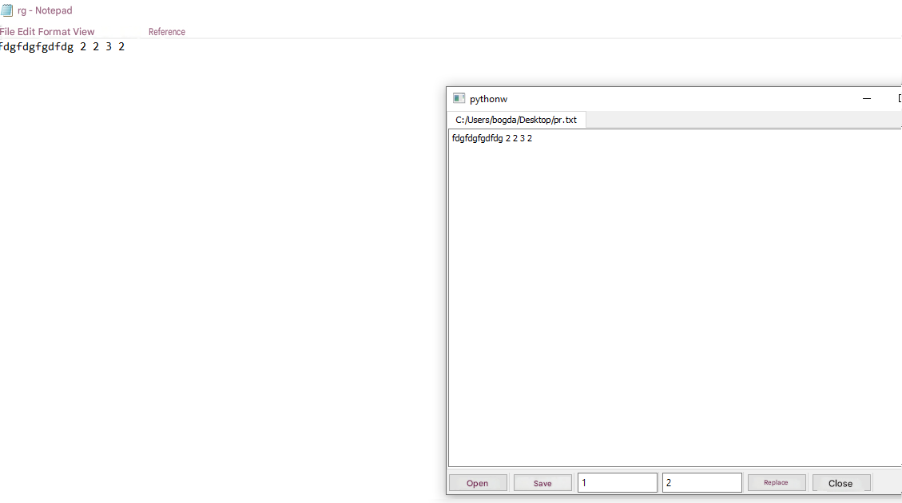
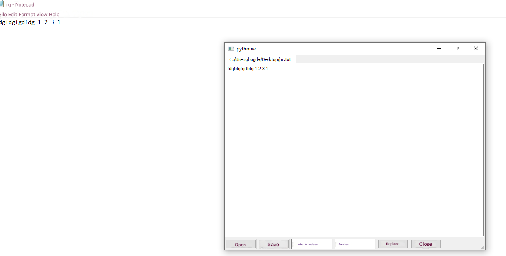

# 📝 Simple Text Editor (Lab 42)


The main point of this app is very simple: you can open `.txt` files, write or edit your text, and save the file back to your computer. That's it!

## ✨ Features
* **Open:** Load a `.txt` file into the editor.
* **Save:** Save your written text as a `.txt` file.
* **Find & Replace:** Quickly find a specific word and replace it with another one.
* **Tabs:** Open multiple text files at the same time in different tabs.

## 📂 Project Files

```text
├── 📂 access/                    # Screenshots for main README
├── 📄main.py                       # The main Python code
└── 📄README.md                     # This info file
```

## 🖼️ Screenshots

Opening and editing a text file:
<p align="center">
  
</p>

Using the find and replace text feature:
<p align="center">
  
</p>

## 🚀 How to Run

1. **Install PyQt5** (if you haven't already):
   ```bash
   pip install PyQt5
