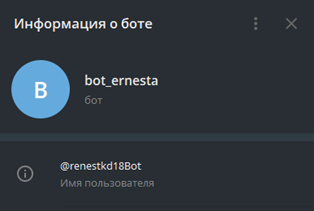
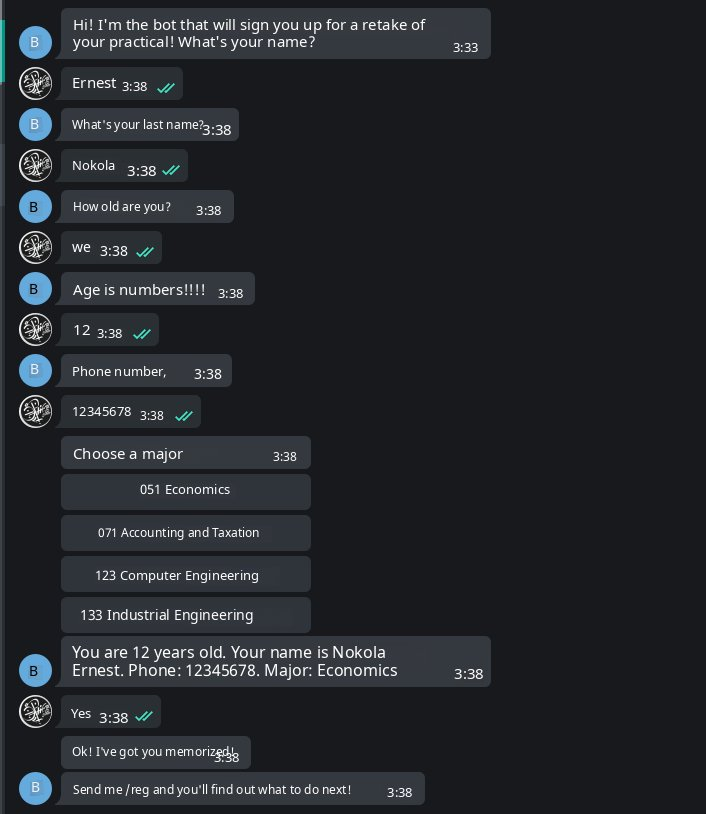
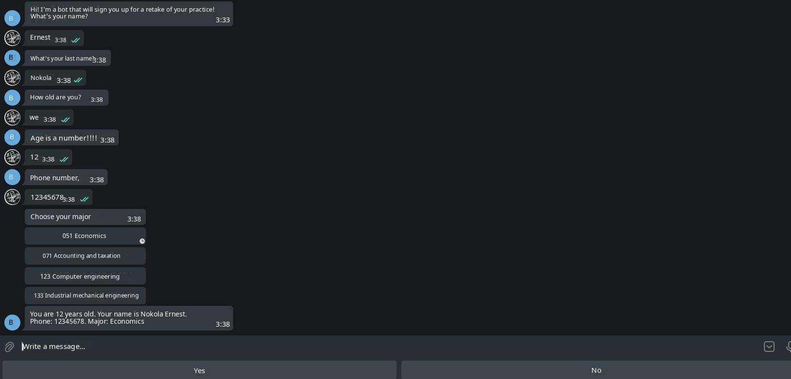

# 🐍 Python Projects

A collection of Python projects developed for learning, practice, and college coursework.

## 📌 Projects

| Project | Description | Technologies |
|---|---|---|
| 📝 **Simple Text Editor** | Desktop text editor for working with `.txt` files | Python, PyQt5 |
| 🤖 **Telegram Applicant Registration Bot** | Telegram bot for registering applicants for college courses | Python, pyTelegramBotAPI |

---

 ### 📂 Repository Structure

```text
.
├── 📄 README.md                             # Global documentation file
├── 📂 Simple Text Editor (Lab 42)/           # Text editor application directory
│   ├── 📂 access/                           # Screenshots for Text Editor README
│   └── 📄 main.py                           # Text editor entry point
└── 📂 telegram-applicant-registration-bot/  # Telegram bot project directory
    ├── 📂 access/                           # Screenshots for Telegram Bot README
    └── 📄 main.py                           # Telegram bot entry point                         
```

# 📝 Simple Text Editor (Lab 42)

The main point of this app is very simple: you can open `.txt` files, write or edit your text, and save the file back to your computer. That's it!

## ✨ Features
* **Open:** Load a `.txt` file into the editor.
* **Save:** Save your written text as a `.txt` file.
* **Find & Replace:** Quickly find a specific word and replace it with another one.
* **Tabs:** Open multiple text files at the same time in different tabs.

### 🖼️ Screenshots

Opening and editing a text file:
<p align="center">
  
</p>

Using the find and replace text feature:
<p align="center">
  
</p>

#  telegram-applicant-registration-bot

A Python Telegram bot developed using the telebot library for registering applicants to college preparatory courses.

### 🤖 Bot Information
* **Bot Name:** bot_ernesta
* **Telegram Username:** [@renestkd18Bot](https://t.me/renestkd18Bot)

<p align="center">
  
</p>

This repository contains the source code for a Python-based Telegram bot built using the **pyTelegramBotAPI** (`telebot`) library. The bot is designed to automate the registration process for students signing up for a **practice retake**.

The bot collects necessary user details step-by-step, validates the input, and provides a clean interactive interface using both **Inline** and **Reply** keyboards.

---

### ⚠️ Limitations & Future Roadmap (College Project Disclaimer)
> **Note:** This is an academic college project developed for educational purposes.

* **Single-User Scope:** Currently, the bot utilizes global variables to temporarily hold user data during the multi-step registration process. Because of this architectural choice, the bot is optimized to handle **one active session at a time** (multiple concurrent users would overwrite each other's registration details).
* **Database Integration (In Progress):** To support scalability and multi-user concurrency, integrating a proper database system (such as SQLite or PostgreSQL) to persist user data is currently **under development** as a major future update.

---

### 🚀 Key Features & Implementation

* 👤 **Step-by-Step Registration:** Collects First Name, Last Name, Age, and Phone Number.
* 🛡️ **Input Validation:** The bot ensures the user enters a numeric value for their age. If they type text, they get an error message and a prompt to retry.
* 🎛️ **Interactive Specialty Selection:** Utilizes **Inline Keyboards** for selecting a major:
  * `051 Economics`
  * `071 Accounting and Taxation`
  * `123 Computer Engineering`
  * `133 Industrial Engineering`
* 📝 **Summary & Confirmation:** Shows a registration summary and requests confirmation using **Reply Keyboards** (`Yes` / `No`).

---

### 📸 Screenshots & Demo

#### 1. Registration Flow & Validation
Here you can see the complete wizard workflow, including validation checking (invalid input `"we"` triggers an error, prompting the user to type numbers):

<p align="center">
  
</p>

#### 2. Interactive Keyboards
A wide-screen demonstration showing the inline buttons for specialty selection and reply buttons for final registration confirmation:

<p align="center">
  
</p>

---

### ▶️ How to Run

1. **Clone the repository:**

   ```bash
   git clone https://github.com/errrrnestt/pyqt5-Lab-collection.git
   cd pyqt5-Lab-collection
   ```

2. **Install dependencies:**

   ```bash
   pip install PyQt5 pyTelegramBotAPI
   ```

3. **Run a project:**

   **📝 Simple Text Editor (Lab 42):**
   ```bash
   python "Simple Text Editor (Lab 42)/main.py"
   ```
   
   **🤖 Telegram Applicant Registration Bot:**
   ```bash
   python "telegram-applicant-registration-bot/main.py"
   ```


